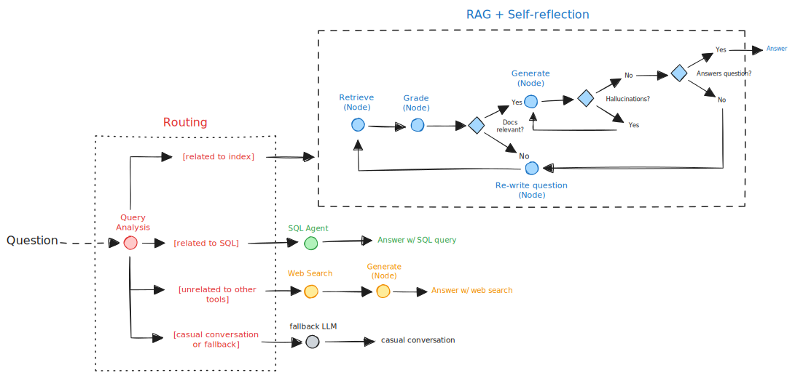

# Self Reflective RAG for a Business  

⚡ Implementing state-of-the-art advanced RAG technique: Self Reflective RAG 💪

## Project Overview

This project implements a self reflective RAG, seamlessly integrating multiple knowledge sources (website, SQL, PDFs) while meticulously aligning with business requirements.

1. What is self-reflective RAG: A self-reflective RAG refers to an adaptive and self-improving system that combines information retrieval and language generation processes to provide more accurate and context-specific responses. Self-Reflective RAG involves a feedback loop where the model evaluates and reflects on its own outputs. This reflection helps in identifying and correcting errors or improving responses.

2. Project use case: I always wanted to create a RAG system which involves multiple knowledge sources, specifically for a business. The project is built for businesses with integration of data sources included but not limited to unstructured: PDFs and Documents, structured: SQL, NoSQL, Graph databases, CSV and more, semi-structured: websites, APIs, and other platforms along with web searching capabilities.

3. Tech-stack:  

| Component         | Technology | Description                                                           |
|-------------------|------------|-----------------------------------------------------------------------|
| RAG               | LangGraph  | Framework used for building the RAG model                             |
| Output Tracing    | LangSmith  | Tool used for tracing and evaluating model outputs                    |
| Indexing          | Pinecone   | Service used for indexing and managing the knowledge base             |
| Web Searching     | Tavily     | Tool used for retrieving information from the web                     |
| LLM               | OpenAI     | Provides the language model for text generation                       |
| Chat Interface    | Gradio     | Interface for interacting with the RAG model                          |
| SQL Database      | SQLite     | Database used for querying business data and for storing RAG's memory |

## How it works?

1. First the user asks a question.
2. The query is analyzed by the router and the RAG is directed to the relevant knowledge source. Available routes: i. Vector store (pdf, website), ii. SQL, iii. Web search, iii. Fallback conversational LLM
3. For the vector store route, the `Retriever Node` fetches relevant documents which is fed to the `Grader Node` for evaluation (whether it is relevant and useful or not). If the documents are not relevant then the `Query Translation Node` re-writes the question and the `Retriever Node` is called again in order to get better documents.
4. If the documents are relevant and useful, the `Generate Node` is called which generates a response to the asked question.
5. The generated response is then checked for hallucination using the `Hallucination Grader`. This grader checks whether the response is grounded or not. If not then the `Generate Node` is called again, otherwise next step is taken.
6. Finally the `Answer Grader Node` is responsible to check whether the generated answer is addressing the question or not. If not then the response generation loop is called again. Otherwise, the response is provided to the user.
7. For other routes, different tools, agents and chains are developed which are called based on the route. Please refer to the image below to better understanding.



## How to use?

### Step 1: Fork and Clone the repository

1. Fork the repo (or directly clone if you don't want to update with your own code).
2. Setup a folder and clone using: `git clone https://github.com/Taha0229/self-reflective-RAG.git .` or `git clone <your/link/to/repo> .` if you have forked.

### Step 2: Setup Virtual Environment [Not required for colab/kaggle]

1. Create a virtual environment using: `conda create --name self-reflective-rag python=3.10 -y`. I have used conda, you can also use your preferred tool to create a virtual environment. If this is your first time with virtual environment, then install and setup conda first.  

### Step 3: Setup Environment Variables

1. Setup environment variables: since we are gonna use multiple APIs (OpenAI, LangSmith (optional but recommended), Tavily and Pinecone), it is recommended to use environment variables otherwise you can hard code your API keys. Create a file named as `.env`. Generate and paste API keys as follows:

``` python
OPENAI_API_KEY = "<your-openai-api-key>"
TAVILY_API_KEY = "<your-tavily-api-key>"
PINECONE_API_KEY = "<your-pinecone-api-key>"
LANGCHAIN_API_KEY = "<your-langchain-api-key>"
LANGCHAIN_TRACING_V2 = "true"
LANGCHAIN_ENDPOINT= "https://api.smith.langchain.com"
LANGCHAIN_PROJECT= "<your-project-name>"
```

### Step 4: Follow the Instruction and Run `langgraph_self_reflective_rag.ipynb`

1. Select a kernel for the jupyter notebook then run all the cells. Or else you can go through each cell and customize as per your needs. I have provided markdown and comments for each and every cell, doc strings are also present for all the classes and function/methods.

2. Cells' structure:

* Setup Environment: 4 cells
* Setup Pinecone Index: 7 cells
* Setup Chains: 18 cells
* Setup Graph: 15 cells
* Setup Chatting Interface: 6 cells

## Implementation

1. Self Reflective RAG is an advanced and state-of-the-art strategy that unites (1) [query analysis](https://blog.langchain.dev/query-construction/) with (2) [active / self-corrective RAG](https://blog.langchain.dev/agentic-rag-with-langgraph/).

2. The implementation is inspired by this [paper](https://arxiv.org/abs/2403.14403).  

3. The architecture involves following data sources/ Routing:

* URL and pdf for the vector store
* SQL database
* Web Search using
* Fallback conversational LLM
  
4. The Self-Reflection loop includes:

* Grading retrieved documents -> re-retrieve or change the data source if document is not relevant
* Hallucination checker -> re-generates the response if hallucination is found
* Answer checker -> checks whether the generated answer addresses the user query or not otherwise generates again
  
1. Previously explored Advanced RAG techniques and research papers:

i. Query Translation:

* Multi-query: [paper](https://arxiv.org/abs/2402.03367)
* RAG-Fusion: [paper](https://arxiv.org/abs/2402.03367)
* Decomposition: [paper1](https://arxiv.org/abs/2212.10509) [paper2](https://arxiv.org/abs/2205.10625)
* Step back: [paper](https://arxiv.org/abs/2310.06117)
* HyDE: [paper](https://arxiv.org/abs/2212.10496)
  
ii. Indexing:

* Multi-representation Indexing: [paper](https://arxiv.org/abs/2312.06648)
* RAPTOR: [paper](https://arxiv.org/abs/2401.18059)
* ColBERT: [blog2](https://hackernoon.com/how-colbert-helps-developers-overcome-the-limits-of-rag) [blog2](https://til.simonwillison.net/llms/colbert-ragatouille)

iii. Other RAG Architectures:

* CRAG

## GitHub Commit message format

Feat– feature

Fix– bug fixes

Docs– changes to the documentation like README

Style– style or formatting change

Perf – improves code performance

Test– test a feature

Example: `git commit -m "Docs: add readme"` or `git commit -m "Feat: add chatting interface"`